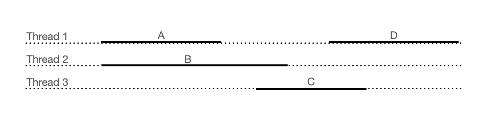
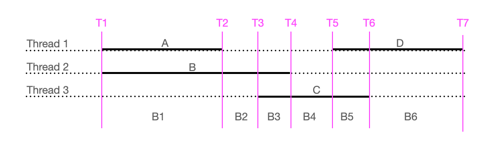

# Show Overlapping

* [Overview](#Overview)
* [Test](#Test)
* [Implementation](#Implementation)

# Overview

Determine the number of overlapping threads or api calls based upon the start time and end times and 
output the maximum number.

It is used to discover the amount of parallelism, which can be useful in debugging issues or configuring for
optimal processing.

Optionally show the identifier for each process as well.

Written to learn Python.

## Input

Given an input file in the format 'start,end,process id'

```
2020-12-30T21:56:44.967572,2020-12-30T21:57:44.042572,id0
2020-12-30T21:57:43.006572,2020-12-30T21:58:35.771572,id1
```

## Output

Outputs lines in the form 'start, end, number of processes, list of each process'

```
2020-12-30T21:56:44.967572,2020-12-30T21:57:43.006572,58039,1,['id0']
2020-12-30T21:57:43.006572,2020-12-30T21:57:44.042572,1036,2,['id0', 'id1']
2020-12-30T21:57:44.042572,2020-12-30T21:58:35.771572,51729,1,['id1']
```

# Test

## Generate Test Data

_generate-testdata.py_ provides testdata

```
python3 test/generate-testdata.py --count 30 | python3 overlap/overlap.py
```

## API Manager Test

```
cat test/api-input.csv | python3 api-manager/api_manager.py | python3 overlap/overlap.py
```

# Implementation

Consider 3 threads each of which run units of work. On this diagram, Thread 1 processes
Work A, then pauses, then processes Work D.  Time passes from left to right.



We can break up the time into buckets, where each bucket begins when a unit of work either
starts or finishes. On this diagram there are 6 buckets.



Collect all the start and end points of each unit of work into an ordered list of timestamps

```
nodes = [
    T1 = [Astart, Bstart], 
    T2 = [Aend],
    T3 = [Cstart],
    ...
    T7 = [Dend]
]
```
Then create a bucket for each node 

```
for each node in nodes
    bucket = copy of previous bucket
    for each point in node
        if point is start
            add Work to the bucket
        else // point is end
            remove Work from the bucket
```            

Each bucket contains a list of Work that was performed.

```
bukets = [
    [A, B],   // B1
    [B],      // B2
    [B, C],   // B3
    [C],      // B4
    [C, D],   // B5
    [D]       // B6
]
```
The bucket with the largest list represents the most parallism. By storing the start and end of 
bucket you can also work out the duration of the buckets.
